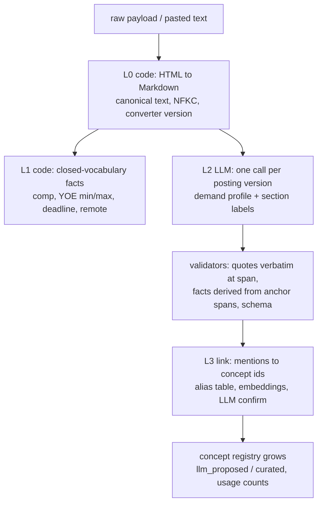

---
title:
  Parsing direction — LLM-first extraction, unified demand-profile format, and
  what runs it
date: 2026-08-17
type: analysis
status: current
---

# Parsing direction (consolidated 2026-08-17)

Settles two questions after a week of prototypes: **what is the parsing model
for job postings**, and **what should run the digestion** — the user's own
agent, a hosted API, or a self-hosted open model. Supersedes the extraction half
of `2026-08-16-parsing-prototype-report.md` (its addendum already marks the flat
keyword model as retired); the storage/claims-grammar decisions in
`2026-08-09-data-exploration.md` and the 2026-08-16 data-model discussion stand.

> [!TLDR] Evidence-first demand profile; LLM as labeler now, small models later
>
> A posting compiles once per version into a **demand profile**: a handful of
> demand areas, each holding atomic **claims** (verbatim quotes with their own
> importance, level, threshold), a recursive structure over those claims, and
> the surface forms mentioned. The record is **evidence-first**: a generated
> `description` is an optional projection labelled with what produced it
> (`llm | template | none`), and a template renderer must be able to emit a
> valid record with no generative text at all. Code owns structure, facts with a
> closed vocabulary, and validation; the LLM owns judgment (what belongs
> together, importance/level wording, nested logic) and is the **labeler** from
> day one; each L2 sub-task is designed to be replaced by a small model trained
> on those labels; concept ids are attached afterwards by a linker over a
> registry that grows from the corpus. Run it now on the user's own agent
> (`claude -p`, wired, zero marginal cost); evaluate a self-hosted open model on
> the same gold when it exists; synthesis, if kept at all, moves to match time
> on the shortlist.

## Why the direction changed

Three findings from 2026-08-16/17, in the order they landed:

1. **Rules generalise only to the vocabulary they were seeded with.** The merged
   rule parser hit 16/16 exact expression trees on the two fixture postings it
   was built against, then **1/12** on unseen bullets from a LinkedIn AI-match
   readout and effectively **0** on a pasted Notion posting (its heading
   vocabulary alone — "Skills You'll Need To Bring", "What You'll Achieve" —
   dropped every requirement into `other`). Every new posting brings words the
   gazetteer lacks (LLVM, GlobalISel, TableGen, PTX; Cursor, Claude Code). A
   vocabulary you must enumerate by hand cannot cover a million postings; the
   user's ruling was blunt and right: _"the biggest problem is regex. we can't
   exhaust 1m jobs jd."_
2. **A level is a lossy compression.** `skill:gcp proficient/32mo` throws away
   "ran GKE clusters, set up the ArgoCD pipeline" — and that is what a reader
   compares. Ruling: _"a description of skill instead of did I tick keywords."_
3. **The most valuable extraction is the demand description**, not the atom. For
   Notion's "started exploring AI/ML" the meaning lives in the Role and
   What-You'll-Achieve sections: retrieval, orchestration, evals, serving
   latency/cost, guardrails. Ruling on that block: _"these are the most
   important things."_

What survives from the rule work: HTML normalisation as a code stage (now HTML →
Markdown rather than a node tree), verbatim spans as provenance, the
eval-harness habit, the `claude -p` structured-output wiring with schema + code
validation, four fixture postings, and the concept-graph design (kinds, facets,
typed edges) — now populated by extraction instead of by hand.

A fourth ruling landed on 2026-08-17 in answer to "is an LLM the only
solution?": no — the LLM is the right _first_ engine because it needs no labels,
but the record must not depend on it. Hence evidence-first areas, synthesis as a
labelled projection, and L2 designed as separable sub-tasks so each can be
replaced by a trained small model as labels accumulate.

## The parsing model



| layer | owner              | vocabulary    |
| ----- | ------------------ | ------------- |
| L0    | code               | none          |
| L1    | code (regex)       | closed sets   |
| L2    | LLM                | none up front |
| L3    | code + embed + LLM | emergent      |
| L4    | small model        | learned       |

- **L0** converts HTML to **Markdown**, which is the only canonical text
  (revised 2026-08-17 after review: the node tree is not stored — headings, list
  nesting and bold lead-ins survive in the markdown itself, and a
  `blocks(markdown)` function derives offsets on demand for diffing). The
  converter is versioned; raw HTML is archived, so a source map back to HTML is
  not needed. A source adapter is three lines.
- **L1** owns money, dates, `N+ years`, `0-2 YOE`, `until July 17, 2026`,
  remote/hybrid tokens — and doubles as the validator of L2 output.
- **L2** produces the demand profile below, keyed by the **document hash +
  normalizer version + model/prompt/schema/validator versions** (see identities
  below). The first implementation is one LLM call, but the task is defined as
  **six separable sub-tasks** whose outputs are stored and evaluated separately:
  (1) demand-span selection — which sentences state a demand; (2) grouping spans
  into areas, including cross-section association (requirement bullet ↔
  responsibility bullets); (3) importance / level / negation per claim; (4)
  structure — nested logic over claims; (5) naming an area; (6) optional
  synthesis of a description. Sub-tasks 1–3 and 5 are classification-shaped and
  are the first to be replaced by small models trained on L2's own outputs; 4
  stays LLM for the minority of bullets that need it; 6 is dropped from
  extraction time unless evaluation shows generated descriptions improve
  matching over verbatim-evidence clusters — in which case it runs at match time
  on the shortlist.
- **L3** maps surface forms to concept ids; unknown forms become new concepts
  with `provenance: llm_proposed` and usage counts.
- **L4** (later) replaces L2 sub-tasks one at a time with small models trained
  on a few thousand LLM-labelled postings (span classifier, importance/negation
  classifier, cluster naming, linker); the LLM keeps nested logic and
  low-confidence cases. This is also the strictly-local option for the résumé
  side.

Regex keeps exactly two jobs — closed-vocabulary facts, and checking LLM output
against the text — and loses the two it cannot do: knowing words and parsing
syntax.

### Artifact identities

`content_hash` had been doing four jobs (raw payload, employer-visible version,
canonical text, and extraction cache key). They are separate identities:

| artifact           | identity                                                    |
| ------------------ | ----------------------------------------------------------- |
| raw capture        | hash of raw bytes; one per fetch attempt                    |
| posting version    | hash over an explicit semantic field list + hash version    |
| canonical document | posting version + normalizer version + markdown hash        |
| extraction run     | document identity + model + prompt/schema/validator version |

Metadata churn (a re-serialised timestamp) then cannot trigger re-extraction,
and a converter or prompt upgrade cannot masquerade as an employer edit.

## Unified format

One record per canonical **document** (posting version × normalizer version; see
identities above); earlier versions are kept. Field groups, in the order they
are produced:

```jsonc
{
  "posting": {                     // source-normalised record (docs/sources/README.md draft)
    "source": "greenhouse", "board": "anthropic", "source_id": "5186067008",
    "title": "…", "company": "…", "locations": [], "workplace_type": null,
    "url": "…", "source_created_at": "…", "source_updated_at": null,
    "fetch_method": "api | jsonld | paste",
    "raw_capture_hash": "…", "version_hash": "…", "version_hash_v": 1
  },
  "document": {                    // L0 — the only canonical text
    "markdown": "## Skills You'll Need To Bring\n\n- **Expertise building…",
    "document_hash": "…", "normalizer_version": "md/1"
    // blocks(markdown) is a function used for diff/display, not a stored table
  },
  "facts": {                       // L1 anchors + L2 interpretation, each tied to a span
    "experience_months": {"min": 0, "max": 24, "scope": "total", "anchor": {"quote": "0-2 YOE", "span": [..]}},
    "compensation": [{"min": 130000, "max": 150000, "currency": "USD",
                      "period": "year", "condition": "SF/NY", "level": null, "span": [..]}],
    "deadline": null, "workplace": null, "eligibility": [], "boilerplate_spans": []
  },
  "demand_profile": {              // L2 — evidence-first; the matching unit
    "areas": [{
      "id": "a3",
      "name": "AI/ML product engineering",                  // sub-task 5
      "kind": "technical | capability | trait | credential | constraint",
      "importance": "required | preferred | contextual",     // area default; claims may override
      "level": "expert | proficient | working | exposure | null",   // null = unstated (never guessed)
      "claims": [{                                          // atomic, evidence-bound units (sub-tasks 1,3)
        "id": "c7",
        "quote": {"text": "started exploring AI/ML through coursework, projects, internships, or hackathons",
                  "span": [s, e]},                           // verbatim; validated markdown[s:e] == text
        "importance": "required", "level": "exposure", "level_evidence": "started exploring",
        "negated": false,
        "threshold": null,                                   // e.g. {"months": 24, "scope": "managing"}
        "qualifiers": ["with guidance"],
        "evidence_sources": ["coursework", "projects", "internships", "hackathons"]
      }],
      "context": [{"text": "…verbatim responsibility bullet…", "span": [s, e]}],  // sub-task 2: cross-section
      "structure": {"op": "AND", "of": ["c7", "c8"]},         // sub-task 4: recursive over claim ids
      "mentions": ["LLMs", "embeddings", "retrieval", "orchestration", "evals"],
      "description": {                                       // OPTIONAL projection (sub-task 6)
        "text": "…", "synthesis": "llm | template | none", "run": "…"
      }
    }],
    "interview_evaluated": ["a7", "a8"]   // trait/values areas routed out of matching
  },
  "links": [                       // L3
    {"mention": "Claude Code", "concept": "tool:claude-code", "method": "alias | embed | llm",
     "confidence": 0.93, "status": "active | provisional"}
  ],
  "extraction": {                  // reproducibility tuple
    "model": "claude-sonnet-5", "prompt_version": "demand-profile/v1",
    "schema_version": "1", "validated": true, "cost_usd": 0.05, "at": "2026-08-17T…"
  }
}
```

Rules that keep it honest:

- Every claim and area carries verbatim `quotes`; validation requires
  `markdown[start:end] == quote.text` or the call is retried with the error.
  This is an **attribution gate**, not a truth gate: it proves the text exists,
  not that the description is entailed by it. Polarity ("no Kubernetes
  experience required"), omission of a requirement, and a fabricated description
  around a real quote are caught only by evaluation and, at runtime, by
  k-sampling disagreement → `needs_review`.
- Facts are **derived from anchor spans by code**, not checked as literal
  numbers: `0-2 YOE` → `{min: 0, max: 24}` is a deterministic transform of a
  span L1 found; the LLM points at the span, code computes the value.
- Importance and level are **versioned interpretations** of the posting's
  wording (with the evidence phrase stored), not immutable facts; `level` is
  `null` when the wording states none — the project's null-over-guess rule
  applies here too. The later matching judge does not rewrite them.
- **Areas hold atomic claims.** An area is the description-first unit for
  presentation and matching context; its `claims[]` are the atomic,
  evidence-bound units, each with its own importance, level, threshold and
  scope, and `structure` is a recursive expression over claim ids. This is what
  lets one area hold "5+ years overall including 2+ managing", "(Python or Go)
  and distributed systems", "degree or equivalent experience", or a required and
  a preferred statement side by side.
- **The record is evidence-first.** Everything a matcher or a reader needs is in
  `claims[].quote`, `context[]`, `structure`, `mentions`; `description` is a
  projection, labelled with `synthesis`, and a template renderer (name + ordered
  quotes) must produce a valid record with `synthesis: none`. No stage is
  allowed to require generative text as input.
- `links` are separate from `areas` so the demand profile is stable while the
  concept registry evolves.

## What runs the digestion

The question is a choice with a price, so the options are made commensurable
first and the rubric comes after. It is asked per L2 sub-task, not once:
classification-shaped sub-tasks migrate to small models as labels accrue; nested
logic and low-confidence cases stay with a large model longest.

| option                       | quality       | $/1k postings | $ at 1M     | resume local? |
| ---------------------------- | ------------- | ------------- | ----------- | ------------- |
| A. own agent (`claude -p`)   | frontier      | ~$0 marginal  | n/a         | no            |
| B. hosted API (Haiku/Sonnet) | frontier      | $8 / $24      | $8k / $24k  | no            |
| C. self-hosted open model    | unmeasured    | ~$0.1–0.5\*   | ~$100–500\* | **yes**       |
| D. distilled small model     | teacher-bound | ~$0           | ~$0         | **yes**       |

\* inferred order of magnitude, not benchmarked.

- **A** — user's own agent through the CLI; measured 7/8 on re-treeing; data
  goes to the user's own provider under their own account; no ops.
- **B** — Anthropic API, Haiku 4.5 or Sonnet 5; same privacy posture as A; adds
  key management and quotas.
- **C** — Qwen3 / Gemma 3 / Llama 3.x in the 8–32B range with JSON-schema
  decoding via vLLM or ollama; plausible for sections and facts, unknown for
  faithful descriptions; the only option that never sends the resume anywhere;
  costs model serving, upgrades, and eval upkeep.
- **D** — later; bounded by its teacher; costs a training pipeline and drift
  monitoring.

Prices for B are Anthropic first-party list rates ($1/$5 Haiku, $3/$15 Sonnet
per 1M tokens) applied to a rough 4k-in / 0.8k-out call. Everything in the C row
is order-of-magnitude and marked inferred; nothing was benchmarked.

Rubric — the axis that flips the choice is **measured quality on the demand
profile gold**, and the second axis is **which side of the match the data comes
from**:

- **Job side, now:** A. It is wired, costs nothing extra, and postings are
  public data. Move to B only if the corpus outgrows the subscription (thousands
  of new versions a day).
- **Resume side, now:** A, with eyes open — the "personal data never leaves the
  machine" ethos is satisfied only in the weaker sense that it goes to the
  user's own agent provider. **This is the real argument for C**: a local model
  is the only engine that keeps the dossier strictly on-device.
- **Self-hosting (C):** yes, evaluate it — but as a measured decision, not a
  belief. Build the extractor with a pluggable backend (`claude -p` and an
  OpenAI-compatible endpoint, which covers vLLM, ollama, llama.cpp), then run a
  14B-class open model on the same fixtures against the same gold. Adopt for the
  job side if it lands within a few points of the frontier model on area
  agreement and verbatim-quote rate; adopt for the resume side if it is merely
  adequate, because privacy outweighs a few points there. Disconfirmer: if the
  open model invents quotes or misses required areas at a rate the validators
  cannot repair with one retry, stay on A/B and retest at 30B.
- **Scale (D):** the answer for a million postings is neither API nor a big
  local model per posting; it is distillation. Not before there is a corpus to
  distil from.

"Our task is quite easy" is half true, and the half matters: heading→section,
salary/YOE facts, and "any of X, Y, Z" structure are easy and a small model or
even L1 handles them. Writing a faithful demand description with verbatim
support, and pulling it from responsibilities rather than the requirement
bullet, is the part that separates engines — that is exactly what the gold must
measure.

## Evaluation, restated

- The 24-bullet expression gold (`prototypes/parsing/gold/`) measured structure
  extraction by rules; it is **retired as the headline metric** and kept as a
  unit test for L1/validators.
- New gold, two sets with different jobs: a **development set** — the four
  fixtures (Anthropic Greenhouse, Ramp Ashby, Notion paste, NVIDIA paste), used
  to shape the prompt and schema and as regression; and a **held-out set**
  reserved before prompt iteration begins, never looked at while iterating, used
  only to compare engines. Labels are authored independently from the text, not
  by editing model output; a sample is double-annotated. Metrics: claim
  precision/recall, missed-required rate, spurious-area rate, verbatim-quote
  rate, negation/polarity accuracy, importance/level agreement, fact accuracy,
  repeatability across k samples, and slices by source and language.
- Same gold, every engine: the frontier model, the open model, later the
  distilled one. That is what makes the self-hosting question answerable.

## Next steps

- [ ] One normative spec covering the ingestion lifecycle state machine
      (per-attempt observation records: every source id seen, completeness,
      fetch/parse health, registry revision; reconciliation on observed ids, not
      on successfully normalised records; interval-censored close times), the
      artifact identities above, and the claim/area schema.
- [ ] L2 extractor with pluggable backend; run on the four fixtures (~$0.20 on
      A); label the dev set independently → demand-profile gold v1; reserve a
      held-out set at the same time.
- [ ] L1 anchors + validators (quote at span, facts derived from anchors).
- [ ] Archive every extraction request, raw response, and validation attempt as
      immutable files, and keep concept-registry curation as an append-only
      event log exported to files — the database is then **recomputable** from
      raw + archives, which is the honest form of "rebuildable" once LLM outputs
      and human merges exist.
- [ ] Ollama/vLLM backend; run a 14B open model on the same four; compare.
- [ ] L3 linker seed: alias table from the mentions the four postings produce.
- [ ] Phase-0 raw collection is still not started; nothing above needs it, but
      history cannot be backfilled.

## Corrections adopted from external review (2026-08-17)

An independent design review (one primary reviewer plus a fresh-context refuter,
no repository changes) raised eight findings; verified against the docs and
prototype before adoption. Dispositions:

1. Reconcile on observed source ids, and the `[]` guard's inverse bug (a healthy
   empty board could never close its last posting) — accepted; folded into the
   ingestion-spec item above.
2. "Rebuildable from raw" is false once LLM outputs and human merges exist —
   accepted; archives + append-only event log; the invariant is now
   "recomputable".
3. `content_hash` conflates four identities — accepted; artifact identities
   table above.
4. Canonical text unresolved and the node stream loses nesting — accepted;
   Markdown is canonical and the converter is versioned. The suggested source
   map back to HTML is not adopted: raw HTML is archived and the converter is
   deterministic, so it adds nothing.
5. Areas cannot express mixed thresholds or nested logic — accepted; `claims[]`
   inside areas with a recursive `structure`. Areas stay first-class rather than
   mere projections, because the description is the matching context the user
   ruled primary.
6. Verbatim quotes prove attribution, not truth, and the "numbers must appear in
   text" rule contradicts normalisation — accepted; wording and validator rules
   rewritten.
7. Mandatory `level` violates null-over-guess — accepted; nullable with an
   evidence phrase.
8. The four fixtures are a development set, not a benchmark — accepted; held-out
   set and independent labelling.

Not adopted: the `<strong>Python</strong>and` → "Pythonand" probe — the source
HTML has no whitespace there and a browser renders it the same way; not a
converter defect.

## Limits

- Cost figures for self-hosting are estimates; no throughput was measured on the
  user's hardware.
- Four postings, two of them reconstructed from text pastes with inferred list
  structure; the gold does not exist yet, so every quality claim about engines
  is a hypothesis.
- No CJK postings have been run through any layer.
