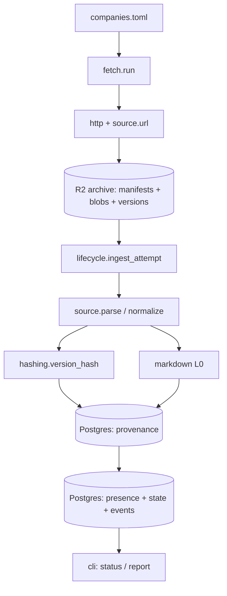
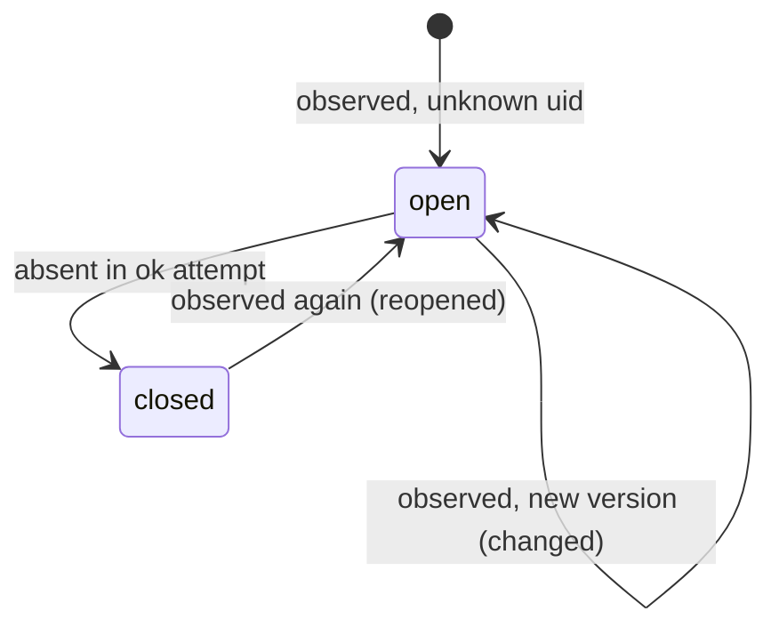

---
title:
  Ingestion layer — archive, identities, temporal store, lifecycle (normative
  spec)
date: 2026-08-18
type: design
status: current
---

# Ingestion layer specification

Normative design for the first build layer of job-hunter: fetching postings from
official ATS APIs into an immutable archive on Cloudflare R2, normalising each
posting into a versioned record and a canonical Markdown document, and
maintaining a recomputable Postgres temporal store (Neon) that tracks every
posting's lifecycle. Design approved section by section in conversation on
2026-08-18; the decisions and rejected alternatives are in section 7. It
resolves the first "next step" of `2026-08-17-parsing-direction.md` (ingestion
lifecycle state machine, artifact identities) and supersedes the ingestion parts
of `2026-08-08-stage1-ingestion-context.md` and `2026-08-09-data-exploration.md`
§3–4 where they differ.

Revision, same day, after the product ruling that the corpus is **one hosted
instance** serving public CLI/MCP users (nobody self-hosts the DB): the store is
Postgres on Neon (the earlier file-based store is withdrawn); per-sample
`observations` became run-length `presence` intervals (the per-sample table
would have grown to ~9M rows a year); `description_html` moved out of the DB
into content-addressed archive objects; `sync` and the ETag protocol were
removed.

> [!TLDR] Files are truth, the database is a build artifact
>
> Every fetch writes an immutable manifest and a content-addressed raw blob to
> R2. The Postgres store is fed only by replaying those manifests, so it can be
> dropped and rebuilt at any time. Provenance tables (attempts, versions,
> documents) are insert-only; presence intervals, posting state and events are
> conclusions recomputed from them. Reconciliation runs on observed source ids
> under a drop guard, close times are intervals, and the layer ends at the
> canonical Markdown document (L0) — no extraction, no LLM, no public API.

## 1. Problem, constraints, non-goals

**Problem.** Lever and Ashby publish no update timestamp and no ATS publishes an
edit history or a close time; majors expire postings after roughly 120 days. The
only way to have posting history is to sample the public boards on a schedule
from day one and diff the samples ourselves — history cannot be backfilled. This
layer is that sampler plus the store that turns samples into lifecycle facts
every later layer (extraction, matching, research, the public API) reads.

**Constraints, all previously ruled and carried here:**

- Official ATS APIs only (Greenhouse, Lever, Ashby); no scraping, no auto-apply.
- **One hosted corpus.** Users install a CLI/MCP client; they never run the
  ingestion or the database. Postings are public data and live in the cloud.
  Users' personal data (résumé, notes, applications, fact base) stays on their
  machine and is never sent to the corpus service; matching runs in the user's
  own agent against documents it fetches. The public read API is a later layer
  and must respect this line.
- Free budget now, cheap later: Cloudflare R2 for the archive (10 GB, 1M Class A
  / 10M Class B operations per month, no egress fees) and Neon Postgres for the
  store (free: 0.5 GB storage, 100 compute-hours per month per project,
  scale-to-zero; Launch: $0.106/CU-hour, $0.35/GB-month, no minimum). Prices
  verified 2026-08-18. Runner: GitHub Actions cron (2,000 Linux minutes per
  month on private repositories) or Cloud Run Jobs. Personal scale is ~100
  boards, ~20–30k open postings, ~1 GB of archive per year, and a DB that must
  stay index-sized (tens of MB per year) — text goes in the DB only when a query
  needs it.
- Python 3.12+, uv, Postgres 17 (Neon), `psycopg` 3, plain SQL.
- Deterministic and versioned: every derived artifact carries the version of the
  code that made it, and unchanged inputs produce byte-identical outputs.
- Per-record failure isolation; a broken feed can never mass-close a board.
- Exactly one writer (the scheduled job); readers are many and read-only.

**Non-goals for this layer:** L1 fact extraction, L2 LLM demand profiles, L3
linking, embeddings, full-text search, repost/duplicate clustering, discovery of
new boards, JSON-LD or Workday adapters, the public read API and MCP server,
auth and rate limiting, a TUI, multi-writer ingestion. Each has a place reserved
(section 5.6) and nothing more.

## 2. Proposed design

A daily job reads `companies.toml`, takes a Postgres advisory lock so two runs
cannot overlap, and for each board fetches the API once, writes a manifest and
(if new) a blob to R2, then runs the ingest algorithm on the manifest it just
wrote. Ingest parses the blob with the source adapter, inserts any new posting
version (archiving its HTML) and its Markdown document, extends or opens a
presence interval per source id, applies lifecycle transitions, and reconciles
absences under the drop guard. `rebuild` runs the identical ingest function over
every manifest in the archive into a fresh schema and must reproduce the
incremental store row for row.



## 3. Components

Each component: responsibility, interface, dependencies. Module paths are under
`src/jobhunter/`.

### 3.1 `config.py`

Resolves settings from environment: `JOB_HUNTER_DATABASE_URL` (Postgres DSN,
required), `JOB_HUNTER_ARCHIVE_URL` (`s3://bucket/prefix` or `file:///path`),
`AWS_ENDPOINT_URL` plus standard AWS credential variables for R2,
`JOB_HUNTER_DROP_RATIO` (default `0.5`), `JOB_HUNTER_REGISTRY` (default
`./companies.toml`), `JOB_HUNTER_HOME` (optional local cache, default
`~/.local/share/job-hunter`). Interface: `Settings.load() -> Settings`. Depends
on nothing.

### 3.2 `registry.py`

Loads and validates `companies.toml`; computes `registry_revision`. Interface:
`load(path) -> Registry` with `Registry.boards: list[Board]` and
`Registry.revision: str`; `Registry.snapshot_json() -> bytes` (canonical JSON of
the sorted board list — the bytes that are hashed and archived). Validation:
`source` in `{greenhouse, lever, ashby}`, `board` matches `^[A-Za-z0-9._-]+$`,
`(source, board)` unique, `company` non-empty. Depends on `models`.

```toml
[[boards]]
company = "Anthropic"
source  = "greenhouse"
board   = "anthropic"
# optional
country = "US"
tags    = ["ai"]
```

### 3.3 `models.py`

Frozen dataclasses shared by every module: `Board`, `AttemptManifest`,
`RawRecord(source_id: str | None, index: int, payload: dict)`, `PostingVersion`
(fields in section 5.3, plus `description_html` in memory only), `Document`. No
logic beyond validation. Depends on nothing.

### 3.4 `sources/`

One module per ATS implementing the `Source` protocol in `sources/base.py`:

```python
class Source(Protocol):
    name: str                      # "greenhouse" | "lever" | "ashby"
    adapter_version: str           # e.g. "greenhouse/1"
    def url(self, board: Board) -> str: ...
    def parse(self, body: bytes) -> Iterator[RawRecord]: ...   # envelope + per-record id
    def normalize(self, rec: RawRecord, board: Board) -> PostingVersion: ...
```

Endpoints (from `docs/sources/*.md`, live-verified 2026-08-08): Greenhouse
`GET https://boards-api.greenhouse.io/v1/boards/{board}/jobs?content=true`,
Lever `GET https://api.lever.co/v0/postings/{board}?mode=json`, Ashby
`GET https://api.ashbyhq.com/posting-api/job-board/{board}?includeCompensation=true`.
`parse` yields every record with its `source_id` (`None` when the id cannot be
read); it never raises per record — envelope failures raise `EnvelopeError`.
`normalize` follows the mapping table in `docs/sources/README.md` and raises
`NormalizeError` on a single bad record. Adapters do no I/O. Depend on `models`.

### 3.5 `http.py`

One `httpx.Client` with connect timeout 30 s, read timeout 60 s, three retries
with exponential backoff on 429, 5xx and transport errors, no retry on other
4xx, response cap 64 MiB, and `User-Agent: job-hunter/<version> (+<repo url>)`.
Interface: `fetch(url) -> FetchResult(status, body, elapsed, transport)`; never
raises for HTTP status — the caller records it. Boards are fetched with
concurrency 4 across sources. Depends on `httpx`.

### 3.6 `archive/`

`ArchiveStore` protocol (`archive/base.py`) with `LocalFS` (`file://`) and
`S3Compatible` (`s3://`, boto3, works against R2 and MinIO). Keys are built by
`archive/keys.py` (section 5.2); the store itself is a content-addressed
key/value interface:

```python
class ArchiveStore(Protocol):
    def put(self, key: str, data: bytes) -> bool         # False if the key already existed
    def get(self, key: str) -> bytes
    def exists(self, key: str) -> bool
    def list(self, prefix: str, start_after: str | None = None) -> Iterator[str]  # sorted keys
```

`put` is idempotent for content-addressed keys and never overwrites: manifests
and blobs are immutable. Depends on `boto3`, `models`.

### 3.7 `hashing.py`

The single owner of identity computation: `canonical_json(obj) -> bytes`
(`sort_keys=True`, `separators=(",", ":")`, `ensure_ascii=False`, UTF-8),
`version_hash(pv: PostingVersion) -> str` for `VERSION_HASH_V = 1` (field list
in section 5.1), `sha256_hex(bytes)`. Depends on `models`.

### 3.8 `markdown.py`

L0. `to_markdown(html: str) -> str` with `NORMALIZER_VERSION = "md/1"`. Custom
converter over stdlib `html.parser` (decision in section 7). Handles `h1–h6`,
`p`, `br`, `div`/`section` wrappers, `ul`/`ol`/`li` with nesting, `strong`/`b`,
`em`/`i`, `a` (kept as `[text](href)`), `hr`, `blockquote`; drops `script`,
`style`, `img`; unescapes entities first (Greenhouse double-escapes `content`);
applies NFKC; collapses more than one blank line; strips trailing whitespace.
Text-preserving: the visible text of the HTML equals the visible text of the
Markdown after stripping markup. Depends on nothing.

### 3.9 `store/`

`schema.sql` (section 5.3, Postgres dialect), `db.py` (`connect(dsn)`,
`init(conn, schema="public")`, `schema_version`, `advisory_lock(conn)`, read
helpers used by the CLI, `swap_schema` for rebuild), `lifecycle.py` with the one
write path `ingest_attempt(conn, store, manifest, source) -> AttemptResult`
implementing section 5.4. `lifecycle` performs no I/O other than the connection
and `store.get`/`store.put`. Depends on `psycopg`, `hashing`, `markdown`,
`sources`.

### 3.10 `fetch.py`

`run(settings) -> RunSummary`: connect → `pg_try_advisory_lock` (exit cleanly if
another run holds it) → load registry → archive registry snapshot → derive panel
changes → fetch boards → write manifests/blobs → `ingest_attempt` for each new
manifest in `started_at` order → release lock → return summary. Depends on
everything above.

### 3.11 `cli.py`

Typer application, console script `job-hunter`, every command accepts `--json`.
Commands in section 6.2. Depends on `fetch`, `store`, `archive`, `registry`.

## 4. Data flow

Primary path, one board, one day:

1. `fetch.run` connects to Neon and takes the advisory lock; if the schema is
   absent it initialises it.
2. Registry loads; `registry/<revision>.json` is written to R2 if absent;
   `panel` is updated (section 5.5).
3. For board `gh:anthropic`: `http.fetch(url)` → body bytes → `blob_sha256`.
   `put` skips if the sha already exists (unchanged board). Manifest is written
   with `record_count` from `source.parse` (or `null` if the envelope fails).
   The manifest is immutable from this point.
4. `ingest_attempt` loads the blob, parses, normalises each record, computes
   `version_hash`, inserts new versions (writing
   `versions/<version_hash>.html.gz` to R2) and documents, extends or opens
   presence intervals, decides the health verdict, applies transitions,
   reconciles, appends events — all in one transaction per attempt.
5. After all boards the lock is released and the summary printed. Public users'
   CLI/MCP clients read the store through the later API layer; nothing in this
   layer is downloaded to a client.

## 5. Data model

### 5.1 Identities

- **raw capture** — `sha256(body bytes)`; recorded as manifest `blob_sha256`.
- **attempt** — the manifest key
  `attempts/{source}/{board}/{YYYY}/{MM}/{DD}T{HHMMSS}Z.json`; this is
  `fetch_attempts.attempt_id`.
- **posting** — `uid = {source}:{board}:{source_id}` with source prefixes `gh`,
  `lv`, `ab`; `postings.uid`.
- **posting version** — `version_hash` v1, defined below, is a _content_
  identity: two postings with byte-identical employer-visible content share it.
  A `posting_versions` row is therefore keyed by `(uid, version_hash)`.
- **document** — keyed by `(version_hash, normalizer_version)`;
  `document_hash = sha256(markdown)` is the content identity extraction keys on
  and may be shared by versions whose descriptions coincide.
- **registry revision** — `sha256(canonical JSON of the sorted board list)`;
  carried by every manifest and by `panel`.

`version_hash` v1 = `sha256(canonical_json({...}))` over exactly:

- `title` — trimmed.
- `locations` — list of strings, de-duplicated, sorted.
- `workplace_type` — lower-cased, or `null`.
- `is_remote` — boolean, or `null`.
- `department`, `team`, `employment_type` — trimmed, or `null`.
- `compensation` — `{min, max, currency, interval}`, or `null`.
- `description_html` — entity-unescaped, `\s+` collapsed to one space, trimmed.

Excluded on purpose: `url`, `apply_url`, `company`, `source_created_at`,
`source_updated_at`, record ordering, and the raw record. A hash-version bump
means "recompute on rebuild", never "everything changed today".

### 5.2 Archive layout

```text
<prefix>/
  blobs/sha256/<ab>/<sha256>.gz               # verbatim body, gzip, content-addressed
  attempts/<source>/<board>/<YYYY>/<MM>/<DD>T<HHMMSS>Z.json   # one manifest per attempt
  versions/<ab>/<version_hash>.html.gz         # unescaped description HTML per version
  registry/<revision>.json                     # canonical board list, written once per revision
  extractions/                                 # reserved for the next layer (5.6)
```

Manifest fields: `attempt_id`, `run_id`, `source`, `board`, `started_at`,
`finished_at` (UTC ISO-8601), `url`, `http_status` (or `null`), `transport`
(`ok | timeout | dns | tls | connect | http_error | too_large | other`),
`blob_sha256` (or `null`), `payload_bytes`, `record_count` (or `null`),
`adapter_version`, `registry_revision`, `cli_version`, `error` (or `null`; an
HTTP-200 body that fails the source's envelope check keeps `transport = ok` and
sets `error = "envelope: …"` — a board is healthy only when `transport = ok` and
`error` is `null`). Manifests are never edited or deleted; blobs and version
objects are never deleted.

### 5.3 Store schema

Provenance tables are insert-only (`INSERT … ON CONFLICT DO NOTHING`, never
`UPDATE` or `DELETE`). Derived tables may be truncated and regenerated by
replaying the archive; `presence` is append-mostly (only the open interval's
tail moves). Timestamps are `TIMESTAMPTZ` in UTC; the `observed_at` of an
attempt is its `started_at`.

```sql
-- provenance --------------------------------------------------------------
CREATE TABLE fetch_attempts (
  attempt_id        TEXT PRIMARY KEY,           -- manifest key
  run_id            TEXT NOT NULL,
  source            TEXT NOT NULL,
  board             TEXT NOT NULL,
  started_at        TIMESTAMPTZ NOT NULL,
  finished_at       TIMESTAMPTZ NOT NULL,
  http_status       INTEGER,
  transport         TEXT NOT NULL,
  health            TEXT NOT NULL,              -- ok | suspect_drop | error
  blob_sha256       TEXT,
  payload_bytes     INTEGER,
  observed_count    INTEGER NOT NULL DEFAULT 0, -- records with a source id
  parsed_count      INTEGER NOT NULL DEFAULT 0, -- normalised ok
  failed_count      INTEGER NOT NULL DEFAULT 0, -- normalise failed
  unidentifiable_count INTEGER NOT NULL DEFAULT 0,
  prev_observed_count INTEGER,                  -- from the attempt the guard compared to
  adapter_version   TEXT NOT NULL,
  registry_revision TEXT NOT NULL,
  cli_version       TEXT NOT NULL,
  warnings          JSONB,                      -- e.g. {"duplicate_ids": 2}
  error             TEXT
);
CREATE INDEX ix_attempts_board_time ON fetch_attempts (source, board, started_at);

CREATE TABLE posting_versions (
  version_hash      TEXT NOT NULL,              -- content identity; postings may share it
  version_hash_v    INTEGER NOT NULL,
  uid               TEXT NOT NULL,
  source            TEXT NOT NULL,
  board             TEXT NOT NULL,
  source_id         TEXT NOT NULL,
  title             TEXT NOT NULL,
  company           TEXT NOT NULL,
  locations         JSONB NOT NULL,             -- array of strings
  workplace_type    TEXT,
  is_remote         BOOLEAN,
  department        TEXT,
  team              TEXT,
  employment_type   TEXT,
  compensation      JSONB,                      -- {min,max,currency,interval} or NULL
  url               TEXT,
  apply_url         TEXT,
  source_created_at TIMESTAMPTZ,
  first_seen_attempt TEXT NOT NULL REFERENCES fetch_attempts (attempt_id),
  PRIMARY KEY (uid, version_hash)               -- one row per posting per content version
  -- description_html lives at versions/<version_hash>.html.gz in the archive
);
CREATE INDEX ix_versions_hash ON posting_versions (version_hash);

CREATE TABLE documents (
  version_hash       TEXT NOT NULL,             -- content identity of the source version
  normalizer_version TEXT NOT NULL,
  document_hash      TEXT NOT NULL,             -- sha256(markdown); shared when texts coincide
  markdown           TEXT NOT NULL,             -- TOAST-compressed by Postgres
  PRIMARY KEY (version_hash, normalizer_version)
);
CREATE INDEX ix_documents_hash ON documents (document_hash);

-- derived -----------------------------------------------------------------
CREATE TABLE presence (                          -- run-length presence intervals
  uid            TEXT NOT NULL,
  version_hash   TEXT,                          -- NULL when normalise failed
  parse_status   TEXT NOT NULL,                 -- ok | failed
  first_attempt  TEXT NOT NULL,
  last_attempt   TEXT NOT NULL,
  first_at       TIMESTAMPTZ NOT NULL,
  last_at        TIMESTAMPTZ NOT NULL,
  runs           INTEGER NOT NULL,              -- consecutive attempts in the interval
  PRIMARY KEY (uid, first_attempt)
);
CREATE INDEX ix_presence_last ON presence (last_attempt);
CREATE INDEX ix_presence_uid_last ON presence (uid, last_at DESC);

CREATE TABLE runs (
  run_id         TEXT PRIMARY KEY,
  started_at     TIMESTAMPTZ NOT NULL,
  finished_at    TIMESTAMPTZ NOT NULL,
  cli_version    TEXT NOT NULL,
  boards_total   INTEGER NOT NULL,
  boards_ok      INTEGER NOT NULL,
  boards_suspect INTEGER NOT NULL,
  boards_error   INTEGER NOT NULL
);

CREATE TABLE panel (
  source            TEXT NOT NULL,
  board             TEXT NOT NULL,
  company           TEXT NOT NULL,
  added_at          TIMESTAMPTZ NOT NULL,
  removed_at        TIMESTAMPTZ,
  registry_revision TEXT NOT NULL,              -- revision that added the row
  PRIMARY KEY (source, board, added_at)
);

CREATE TABLE postings (
  uid                  TEXT PRIMARY KEY,
  source               TEXT NOT NULL,
  board                TEXT NOT NULL,
  source_id            TEXT NOT NULL,
  status               TEXT NOT NULL,           -- open | closed
  current_version_hash TEXT,                    -- NULL only if never parsed ok
  version_count        INTEGER NOT NULL DEFAULT 0,
  reopen_count         INTEGER NOT NULL DEFAULT 0,
  first_seen_attempt   TEXT NOT NULL,
  first_seen_at        TIMESTAMPTZ NOT NULL,
  last_seen_attempt    TEXT NOT NULL,
  last_seen_at         TIMESTAMPTZ NOT NULL,
  closed_lower_at      TIMESTAMPTZ,             -- last_seen_at when closed
  closed_upper_at      TIMESTAMPTZ,             -- started_at of the closing attempt
  closed_by_attempt    TEXT,
  source_updated_at    TIMESTAMPTZ              -- latest value seen; metadata only
);
CREATE INDEX ix_postings_board_status ON postings (source, board, status);

CREATE TABLE posting_events (
  event_id        BIGINT GENERATED ALWAYS AS IDENTITY PRIMARY KEY,
  uid             TEXT NOT NULL,
  kind            TEXT NOT NULL,                -- opened | changed | closed | reopened
  attempt_id      TEXT NOT NULL,
  at              TIMESTAMPTZ NOT NULL,         -- attempt started_at
  from_version    TEXT,
  to_version      TEXT,
  closed_lower_at TIMESTAMPTZ,
  closed_upper_at TIMESTAMPTZ
);
CREATE INDEX ix_events_uid ON posting_events (uid, event_id);
CREATE INDEX ix_events_time ON posting_events (at);

CREATE TABLE schema_meta (key TEXT PRIMARY KEY, value TEXT NOT NULL);
-- keys: schema_version, last_ingested_attempt, last_ingested_at
```

Why `presence` and not one row per posting per attempt: at ~25k open postings
sampled daily, per-sample rows reach ~9M a year (roughly 1.5–2.5 GB), which
would exhaust Neon's free storage in months. A run-length interval row is
extended while consecutive attempts see the same
`(uid, version_hash, parse_status)`; a new row starts when any of those change
or continuity breaks. Row count is on the order of postings ever seen, not
samples. It is still fully derivable from the archive; `rebuild` regenerates it.

`runs` and `panel` are derived: a run row is the aggregate of its attempts, and
panel intervals follow from the sequence of runs and the registry snapshot each
one used. They are persisted for query convenience only.

### 5.4 Lifecycle



`ingest_attempt(conn, store, manifest, source)`, executed in one transaction:

1. **Idempotence.** If `manifest.attempt_id` exists in `fetch_attempts`, return
   without changes. If `manifest.started_at` is older than
   `schema_meta.last_ingested_at`, raise `OutOfOrder` (rebuild required).
2. **Load and parse.** If `transport != ok` or `blob_sha256` is `null`, insert
   the attempt with `health = error` and stop. Otherwise get the blob and call
   `source.parse`. An `EnvelopeError` → `health = error`, stop. No presence is
   touched for an `error` attempt and no reconcile happens.
3. **Per record, isolated.** Two distinct "previous" attempts are used: `prev`
   is the most recent attempt for `(source, board)` with `health != error` and
   feeds only the drop guard (step 4); `prev_any` is the most recent attempt of
   any health and governs presence continuity — an `error` attempt is an
   unobserved gap, so an interval never extends across one. For each
   `RawRecord`: if `source_id` is `None`, count it in `unidentifiable_count` and
   continue. Else normalise; on `NormalizeError` the record is present with
   `parse_status = failed` and no version; on success compute `version_hash`,
   `INSERT … ON CONFLICT DO NOTHING` the version (with
   `first_seen_attempt = this`), write `versions/<ab>/<version_hash>.html.gz` if
   absent, compute the document under `NORMALIZER_VERSION` and insert it
   likewise, and the record is present with `parse_status = ok`. Then
   **presence**: let `cur` be the `presence` row for `uid` with the greatest
   `last_at`. If `cur` exists and `cur.last_attempt = prev_any.attempt_id` and
   `cur.version_hash` and `cur.parse_status` equal this record's → extend it
   (`last_attempt = this`, `last_at`, `runs + 1`); otherwise insert a new
   interval starting at this attempt. A second record with an already-seen
   `source_id` in the same attempt is skipped and counted in
   `warnings.duplicate_ids`.
4. **Health verdict.** If `prev` exists and
   `observed_count < DROP_RATIO × prev.observed_count` →
   `health = suspect_drop`, else `ok`. Store `prev_observed_count`.
5. **Transitions** for every uid present in this attempt (`ok` and `failed` both
   mean present):
   - no `postings` row → insert `status = open`, `first/last_seen = this`,
     `current_version_hash = version_hash` (may be `NULL`), `version_count = 1`
     if a version exists; event `opened(to_version)`.
   - `open`, `version_hash` equal or `NULL` → update `last_seen_*` only.
   - `open`, different `version_hash` → set `current_version_hash`,
     `version_count += 1`, `last_seen_*`; event `changed(from, to)`.
   - `closed` → `status = open`, `reopen_count += 1`, clear `closed_*`, set
     `last_seen_*`, and if the version differs set it and `version_count += 1`;
     one event `reopened(from, to)`.
   - `source_updated_at` is refreshed from the record whenever present.
6. **Reconcile**, only if `health == ok`: every `postings` row on
   `(source, board)` with `status = open` whose `uid` has no `presence` row with
   `last_attempt = this` → `status = closed`, `closed_lower_at = last_seen_at`,
   `closed_upper_at = attempt.started_at`, `closed_by_attempt = this`; event
   `closed(from_version, closed_lower_at, closed_upper_at)`.
7. Insert the attempt row with its counts and health; upsert the `runs` row; set
   `schema_meta.last_ingested_attempt / _at`.

Why the guard is a drop guard and not an emptiness guard: a healthy board going
from one posting to zero is a 100 % drop, so that attempt is `suspect_drop` and
closes nothing; the next attempt compares 0 against 0, is `ok`, and closes the
last posting with the correct lower bound. A Lever board that returns `200 []`
because it is dead closes everything after two runs, which is the truthful
outcome; `status` shows the board at zero so the registry can be fixed. A
transient partial response defers closures by one run at the cost of one run's
width in the close interval.

### 5.5 Panel

At the start of a run, boards in the registry without an open panel row get
`added_at = run.started_at`; open panel rows whose board is no longer in the
registry get `removed_at = run.started_at`. Removing a board stops fetching it
and closes nothing: its postings keep their last `last_seen_at`, and reports
label them "not tracked since". Rebuild reproduces panel from the registry
snapshot recorded by each run's attempts.

### 5.6 Reserved for later layers

`documents.document_hash` is the extraction input. The archive prefix
`extractions/<document_hash>/<engine-tuple>.json` is reserved for every LLM
request, raw response and validation attempt so extraction stays recomputable.
An `extractions` table keyed by
`(document_hash, model, prompt_version, schema_version, validator_version)` is
designed by `2026-08-17-parsing-direction.md` and created by the next layer, not
this one. The public read API and MCP server read `postings`,
`posting_versions`, `documents`, `posting_events` and (later) `extractions`
through a read-only role; users' personal data never enters this database.

## 6. Configuration, CLI, deployment

### 6.1 Environment

- `JOB_HUNTER_DATABASE_URL` — Postgres DSN (Neon, `sslmode=require`); required.
- `JOB_HUNTER_ARCHIVE_URL` — `s3://bucket/prefix` or `file:///path`; required.
- `AWS_ENDPOINT_URL` — R2 endpoint `https://<account>.r2.cloudflarestorage.com`;
  unset for `file://`.
- `AWS_ACCESS_KEY_ID`, `AWS_SECRET_ACCESS_KEY` — R2 API token; required for
  `s3://`.
- `JOB_HUNTER_DROP_RATIO` — drop-guard ratio; default `0.5`.
- `JOB_HUNTER_PING_URL` — optional liveness ping (dead-man's switch), POSTed
  after each completed fetch phase; unset = disabled. See
  `2026-08-25-durability-and-serving.md` §3.1.
- `JOB_HUNTER_REGISTRY` — path to `companies.toml`; default `./companies.toml`.
- `JOB_HUNTER_HOME` — optional local cache; default `~/.local/share/job-hunter`.

### 6.2 Commands

| command                           | effect                                                    |
| --------------------------------- | --------------------------------------------------------- |
| `fetch [--board S:B] [--dry-run]` | lock, run all boards, archive, ingest, print summary      |
| `ingest`                          | replay manifests newer than `last_ingested_attempt`       |
| `rebuild`                         | fresh schema from the whole archive, then swap into place |
| `status`                          | per-board last success, health, counts, error             |
| `report [--since 24h]`            | opened / changed / closed with links                      |
| `registry check \| list`          | validate `companies.toml`; show panel history             |
| `archive ls [--board S:B]`        | list attempts and blob sizes                              |
| `db init \| version`              | create the schema; print schema/DB versions               |

Every command accepts `--json`. Exit codes: `0` normal (per-board errors are
reported in the summary, not fatal; a run that finds the advisory lock held also
exits `0` with "already running"); `2` systemic — archive or database
unreachable, schema mismatch, or every board failed.

### 6.3 Deployment

- Neon project with one database; the job connects with an owner role, the later
  API with a read-only role. Storage stays index-sized (section 1) so the free
  tier holds for a long time; when public traffic arrives, Launch is
  usage-billed with no minimum. Moving hosts is `rebuild` against a new DSN.
- `Dockerfile`: `python:3.12-slim`, uv-installed project, non-root user,
  `ENTRYPOINT ["job-hunter"]`. The same image runs locally, in GitHub Actions
  and on Cloud Run Jobs.
- `.github/workflows/fetch.yml`: `schedule: "0 6 * * *"` plus
  `workflow_dispatch`; secrets `JOB_HUNTER_DATABASE_URL`, `R2_ACCESS_KEY_ID`,
  `R2_SECRET_ACCESS_KEY`; variables `R2_ENDPOINT_URL`, `JOB_HUNTER_ARCHIVE_URL`;
  runs `job-hunter fetch --json` and uploads the summary as an artifact.
- `.github/workflows/test.yml`: unit tests on every push, integration on pull
  requests.
- `companies.toml` lives in the repository root; it is configuration.

> [!WARNING] GitHub disables scheduled workflows after 60 days without commits
>
> A background collector on a quiet repository would silently stop. The fetch
> workflow includes a keepalive step (re-enable via the API or a no-op commit),
> and Cloud Run Jobs with Cloud Scheduler is the documented alternative using
> the same image if the Actions cron proves unreliable.

## 7. Decisions and trade-offs

- **Hosted corpus, users are clients** — one ingestion, one database, public
  CLI/MCP clients through a later read API. Rejected: every user self-hosting
  the pipeline and a local database (the 2026-08-09 premise; withdrawn by the
  2026-08-18 product ruling). Kept from that premise: personal data stays on the
  client.
- **Truth model** — archive files plus insert-only provenance plus regenerable
  state. Rejected: a pure event log with views (every reader pays the
  derivation, and stage 2 needs a posting row to attach to); snapshot-per-run
  tables (defers same/changed/gone to every reader).
- **Engine** — Postgres on Neon. Concurrent public readers, mature FTS and
  `pgvector` for later layers, SQL/PGQ graph queries arriving in Postgres 19 (GA
  targeted September 2026), a free tier that holds an index-sized DB, no ops,
  and a rebuildable store that makes changing hosts trivial. Rejected: SQLite
  (the earlier self-hosted-toolkit choice; wrong for one shared corpus with many
  remote readers, and not kept in any role); MySQL (weaker JSON, no PGQ, thinner
  ecosystem for the FTS/embedding work ahead); Supabase for now ($25 floor, free
  tier pauses after 7 idle days — reconsider when the read API is built, since
  PostgREST + RLS would serve it for free); PlanetScale / DigitalOcean / a
  Hetzner box (better per-GB price at tens of GB of index; not where we are);
  Aurora, RDS, Cloud SQL (idle and I/O pricing for a small, spiky workload).
- **Storage** — Cloudflare R2 from day one. Rejected: local disk (a laptop that
  is off loses days of history); S3 (12-month free tier, egress fees); D1 (100k
  row writes per day, REST access only).
- **Text placement** — Markdown in the DB (queries need it; TOAST compresses
  it), `description_html` in the archive at `versions/<hash>.html.gz`, raw
  records in the blobs. Rejected: all text in the DB (index grows ~10× for data
  no query touches); no text in the DB (search and `get_posting` would
  round-trip to R2 per row).
- **Presence intervals** — run-length rows per `(uid, version, status)`.
  Rejected: one observation row per posting per attempt (~9M rows a year at
  personal scale; sound but unaffordable on the chosen tiers).
- **Runner** — GitHub Actions cron. Alternative documented: Cloud Run Jobs with
  the same image. Rejected: Workers cron (10 ms CPU per invocation on the free
  tier).
- **Single writer by lock** — `pg_try_advisory_lock` at the start of a run.
  Rejected: relying on the cron never overlapping (manual dispatch and delayed
  crons make it overlap).
- **DB feed** — only by replaying manifests. Rejected: writing the DB directly
  from the fetch (recomputability becomes a promise instead of a property).
- **Reconcile guard** — drop ratio against the previous non-error attempt.
  Rejected: emptiness guard (its inverse bug — a healthy board can never close
  its last posting).
- **Close time** — the interval `[closed_lower_at, closed_upper_at]`. Rejected:
  a single `closed_at` (fabricates precision and poisons duration statistics).
- **Identity** — `version_hash` over an explicit, versioned field list.
  Rejected: one `content_hash` doing four jobs (metadata churn triggers
  re-extraction; a converter upgrade masquerades as an employer edit).
- **L0 converter** — custom, stdlib `html.parser`, about 250 lines, golden
  tested. Rejected: `markdownify` / `html2text` (a transitive dependency bump
  silently rewrites every `document_hash`; posting HTML is a small dialect).
- **Migrations** — bump `schema_version`, `rebuild` into a fresh schema, swap.
  Rejected: in-place `ALTER TABLE` on derived tables.
- **CLI** — Typer with `--json` on every command. Rejected: argparse (weaker
  help and UX for an agent-facing surface).
- **Removed board** — stop fetching, `panel.removed_at`, postings untouched.
  Rejected: closing them (fabricates an observation).

Where a source disagreed: the 2026-08-08 briefing said DuckDB first; the
2026-08-09 exploration and the 2026-08-16 rulings said SQLite for a self-hosted
toolkit; the 2026-08-18 product ruling (one hosted corpus) makes Postgres the
answer. Postgres stands.

## 8. Failure modes

- **API timeout or 5xx after retries** — manifest with `transport != ok`,
  attempt `health = error`, no presence change, no reconcile. Next run proceeds;
  the close interval widens honestly.
- **Envelope changes shape** — `EnvelopeError`, attempt `error`, blob still
  archived. Fix the adapter, bump `adapter_version`, `rebuild`.
- **One record malformed** — present with `parse_status = failed`; the other
  records are unaffected and the posting stays open. Fix the adapter later;
  `rebuild` fills in the version.
- **Partial payload (half the board)** — `suspect_drop`; closures deferred one
  run. No action needed.
- **Board dead or token renamed** — zero records twice closes everything after
  two runs; `status` shows the board at zero. Fix `companies.toml`.
- **Duplicate ids in one payload** — first kept, count in `warnings`.
- **Archive unreachable** — exit 2 before any DB change. That day's sample is
  lost; the interval widens.
- **Database unreachable, archive fine** — manifests and blobs are still
  written; ingest is skipped; exit 2. `job-hunter ingest` replays them on the
  next run. Neon scale-to-zero cold start is seconds and is bounded by a 30 s
  connect timeout.
- **Two runs overlap** — the second finds the advisory lock held and exits 0
  with "already running".
- **DB lost, corrupt, or moved to another host** — `rebuild` from the archive
  against the new DSN.
- **Lifecycle bug found** — derived tables wrong, provenance intact. Fix the
  code, `rebuild`.
- **Converter bug** — wrong Markdown under `md/1`. Bump to `md/2`; `rebuild`
  regenerates documents.
- **Out-of-order manifest** — `OutOfOrder` on `ingest`; `rebuild`.
- **Free storage cap approaching** — `status` reports DB size against the plan
  limit; move to Launch or another host, both by DSN change.
- **Actions cron skipped or delayed** — no manifest for that day; the interval
  widens; the keepalive step guards the 60-day rule.

## 9. Testing strategy

- **Unit, no network, no docker.** Per-source `normalize` from recorded records
  (the four fixtures in `prototypes/parsing/fixtures/` plus one trimmed board
  payload per source); `version_hash` golden values and the exclusion list
  (changing `url` or `source_updated_at` leaves the hash unchanged, changing
  `title` changes it); L0 golden `.md` per fixture, text-preservation property,
  idempotent whitespace; `LocalFS` archive round-trips; registry validation.
- **Store tests against a real Postgres** (docker service in `compose.yaml` and
  in CI): lifecycle covering every transition, `1→0` closes on the second run,
  `300→100` defers, `300→0→0` closes, failed-parse-still-present, presence
  extends on consecutive identical samples and splits on change or gap,
  re-ingest of the same manifest is a no-op, `OutOfOrder`, advisory lock, panel
  add/remove.
- **Integration (`docker compose`).** A fake-ATS server serving the three
  sources for scripted "days" (day 2 edits one posting, drops one, adds one; day
  3 returns `[]` for one board and half a board for another) plus MinIO and
  Postgres. Run `job-hunter fetch` per day, assert the exact `posting_events`
  rows and `health` verdicts, then `job-hunter rebuild` from MinIO into a second
  schema and assert every table is identical to the incremental one.
- **Live smoke.** An opt-in script that fetches the three real boards read-only
  and prints counts; never in CI.
- **CI.** Unit and store tests on every push (Postgres service container);
  integration on pull requests; `ruff` and `mypy` on both.

## 10. Rollout

Two increments, one spec:

1. **Archive-first (ships within days).** `config`, `registry`, `models`,
   `sources` (`url` + `parse` + `normalize`), `http`, `archive`, `fetch` writing
   manifests and blobs only, `status` and `archive ls` reading manifests,
   Dockerfile, `fetch.yml` on the daily cron against R2. History starts
   accruing. No database yet.
2. **Store.** Neon project, `hashing`, `markdown`, `store`, `lifecycle`,
   advisory lock in `fetch`, `ingest`, `rebuild`, `report`, `registry list`,
   `db init`; the first `rebuild` replays everything increment 1 collected.
   Nothing collected in increment 1 is wasted.

## 11. Open questions

> [!QUESTION] Not blocking either increment
>
> Ashby returns `isListed: false` postings; they are treated as present like any
> other record and the flag stays in the raw blob. Whether unlisted postings
> should be excluded from reports is a query-time choice for later. The
> keepalive mechanism for the Actions cron (API re-enable vs no-op commit) is
> chosen at implementation. The initial `companies.toml` beyond the three
> verified boards is the user's list. The repository README still describes a
> fully local corpus; it needs a rewrite for the hosted-corpus model, which is
> product copy rather than this spec.
