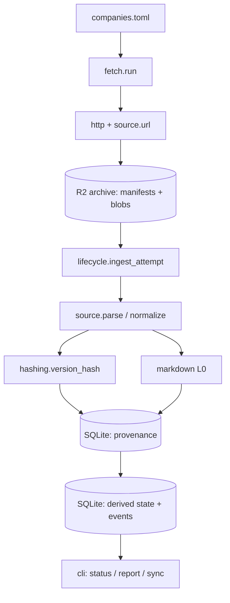
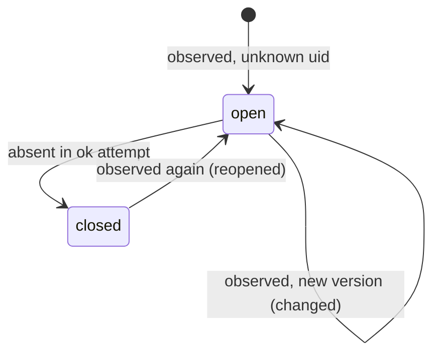

---
title:
  Ingestion layer — archive, identities, temporal store, lifecycle (normative
  spec)
date: 2026-08-18
type: design
status: current
---

# Ingestion layer specification

Normative design for the first build layer of job-hunter: fetching postings from
official ATS APIs into an immutable archive on Cloudflare R2, normalising each
posting into a versioned record and a canonical Markdown document, and
maintaining a recomputable SQLite temporal store that tracks every posting's
lifecycle. Design approved section by section in conversation on 2026-08-18; the
decisions and rejected alternatives are in section 7. It resolves the first
"next step" of `2026-08-17-parsing-direction.md` (ingestion lifecycle state
machine, artifact identities) and supersedes the ingestion parts of
`2026-08-08-stage1-ingestion-context.md` and `2026-08-09-data-exploration.md` §4
where they differ.

> [!TLDR] Files are truth, the database is a build artifact
>
> Every fetch writes an immutable manifest and a content-addressed raw blob to
> R2. The SQLite store is fed only by replaying those manifests, so it can be
> deleted and rebuilt at any time. Provenance tables (attempts, observations,
> versions, documents) are insert-only; the posting state and event tables are
> conclusions recomputed from them. Reconciliation runs on observed source ids
> under a drop guard, close times are intervals, and the layer ends at the
> canonical Markdown document (L0) — no extraction, no LLM.

## 1. Problem, constraints, non-goals

**Problem.** Lever and Ashby publish no update timestamp and no ATS publishes an
edit history or a close time; majors expire postings after roughly 120 days. The
only way to have posting history is to sample the public boards on a schedule
from day one and diff the samples ourselves — history cannot be backfilled. This
layer is that sampler plus the store that turns samples into lifecycle facts
every later layer (extraction, matching, research) reads.

**Constraints, all previously ruled and carried here:**

- Official ATS APIs only (Greenhouse, Lever, Ashby); no scraping, no auto-apply.
- Postings are public data and may live in cloud storage; the personal workspace
  (résumé, notes, fact base) is a different layer and never enters the bucket.
- Storage runs on free budget: Cloudflare R2 (10 GB, 1M Class A / 10M Class B
  operations per month, no egress fees, verified 2026-08-18) and a scheduled
  runner on GitHub Actions cron (2,000 Linux minutes per month on private
  repositories) or Cloud Run Jobs. Personal scale is ~100 boards, ~20–30k open
  postings, ~1 GB of archive per year.
- Python 3.12+, uv, SQLite with JSON1 and portable SQL only.
- Deterministic and versioned: every derived artifact carries the version of the
  code that made it, and unchanged inputs produce byte-identical outputs.
- Per-record failure isolation; a broken feed can never mass-close a board.
- The reader (the user's agent) works against a local file: `job-hunter sync`
  brings the DB down; nothing in this layer needs a server.

**Non-goals for this layer:** L1 fact extraction, L2 LLM demand profiles, L3
linking, embeddings, full-text search, repost/duplicate clustering, discovery of
new boards, JSON-LD or Workday adapters, a TUI, an MCP server, multi-user
access, and any hosted query surface. Each has a place reserved (section 5.6)
and nothing more.

## 2. Proposed design

A daily job pulls the current DB from R2, reads `companies.toml`, and for each
board fetches the API once, writes a manifest and (if new) a blob to R2, then
runs the ingest algorithm on the manifest it just wrote. Ingest parses the blob
with the source adapter, records one observation per source id, inserts any new
posting version and its Markdown document, applies lifecycle transitions,
reconciles absences under the drop guard, and pushes the DB back with a
conditional write. `rebuild` runs the identical ingest function over every
manifest in the archive and must reproduce the incremental DB byte for byte.



## 3. Components

Each component: responsibility, interface, dependencies. Module paths are under
`src/jobhunter/`.

### 3.1 `config.py`

Resolves settings from environment: `JOB_HUNTER_HOME` (local DB and cache,
default `~/.local/share/job-hunter`), `JOB_HUNTER_ARCHIVE_URL`
(`s3://bucket/ prefix` or `file:///path`), `AWS_ENDPOINT_URL` plus standard AWS
credential variables for R2, `JOB_HUNTER_DROP_RATIO` (default `0.5`). Interface:
`Settings.load() -> Settings`. Depends on nothing.

### 3.2 `registry.py`

Loads and validates `companies.toml`; computes `registry_revision`. Interface:
`load(path) -> Registry` with `Registry.boards: list[Board]` and
`Registry.revision: str`; `Registry.snapshot_json() -> bytes` (canonical JSON of
the sorted board list — the bytes that are hashed and archived). Validation:
`source` in `{greenhouse, lever, ashby}`, `board` matches `^[A-Za-z0-9._-]+$`,
`(source, board)` unique, `company` non-empty. Depends on `models`.

```toml
[[boards]]
company = "Anthropic"
source  = "greenhouse"
board   = "anthropic"
# optional
country = "US"
tags    = ["ai"]
```

### 3.3 `models.py`

Frozen dataclasses shared by every module: `Board`, `AttemptManifest`,
`RawRecord(source_id: str | None, index: int, payload: dict)`, `PostingVersion`
(fields in section 5.3), `Observation`, `Document`. No logic beyond validation.
Depends on nothing.

### 3.4 `sources/`

One module per ATS implementing the `Source` protocol in `sources/base.py`:

```python
class Source(Protocol):
    name: str                      # "greenhouse" | "lever" | "ashby"
    adapter_version: str           # e.g. "greenhouse/1"
    def url(self, board: Board) -> str: ...
    def parse(self, body: bytes) -> Iterator[RawRecord]: ...   # envelope + per-record id
    def normalize(self, rec: RawRecord, board: Board) -> PostingVersion: ...
```

Endpoints (from `docs/sources/*.md`, live-verified 2026-08-08): Greenhouse
`GET https://boards-api.greenhouse.io/v1/boards/{board}/jobs?content=true`,
Lever `GET https://api.lever.co/v0/postings/{board}?mode=json`, Ashby
`GET https://api.ashbyhq.com/posting-api/job-board/{board}?includeCompensation=true`.
`parse` yields every record with its `source_id` (`None` when the id cannot be
read); it never raises per record — envelope failures raise `EnvelopeError`.
`normalize` follows the mapping table in `docs/sources/README.md` and raises
`NormalizeError` on a single bad record. Adapters do no I/O. Depend on `models`.

### 3.5 `http.py`

One `httpx.Client` with connect timeout 30 s, read timeout 60 s, three retries
with exponential backoff on 429, 5xx and transport errors, no retry on other
4xx, response cap 64 MiB, and `User-Agent: job-hunter/<version> (+<repo url>)`.
Interface: `fetch(url) -> FetchResult(status, body, elapsed, transport)`; never
raises for HTTP status — the caller records it. Boards are fetched with
concurrency 4 across sources. Depends on `httpx`.

### 3.6 `archive/`

`ArchiveStore` protocol (`archive/base.py`) with `LocalFS` (`file://`) and
`S3Compatible` (`s3://`, boto3, works against R2 and MinIO):

```python
class ArchiveStore(Protocol):
    def put_blob(self, sha256: str, data: bytes) -> bool        # False if already present
    def get_blob(self, sha256: str) -> bytes
    def put_manifest(self, m: AttemptManifest) -> str            # returns attempt_id (key)
    def list_manifests(self, since: str | None = None) -> Iterator[AttemptManifest]  # started_at order
    def put_registry(self, revision: str, data: bytes) -> None
    def get_db(self) -> tuple[bytes, str] | None                # (gzipped db, etag)
    def put_db(self, data: bytes, if_match: str | None) -> str  # etag; raises Conflict on 412
```

Layout inside the prefix (section 5.2). Depends on `boto3`, `models`.

### 3.7 `hashing.py`

The single owner of identity computation: `canonical_json(obj) -> bytes`
(`sort_keys=True`, `separators=(",", ":")`, `ensure_ascii=False`, UTF-8),
`version_hash(pv: PostingVersion) -> str` for `VERSION_HASH_V = 1` (field list
in section 5.1), `sha256_hex(bytes)`. Depends on `models`.

### 3.8 `markdown.py`

L0. `to_markdown(html: str) -> str` with `NORMALIZER_VERSION = "md/1"`. Custom
converter over stdlib `html.parser` (decision in section 7). Handles `h1–h6`,
`p`, `br`, `div`/`section` wrappers, `ul`/`ol`/`li` with nesting, `strong`/`b`,
`em`/`i`, `a` (kept as `[text](href)`), `hr`, `blockquote`; drops `script`,
`style`, `img`; unescapes entities first (Greenhouse double-escapes `content`);
applies NFKC; collapses more than one blank line; strips trailing whitespace.
Text-preserving: the visible text of the HTML equals the visible text of the
Markdown after stripping markup. Depends on nothing.

### 3.9 `store/`

`schema.sql` (section 5.3), `db.py` (`connect(path)`, `init(conn)`,
`schema_version`, read helpers used by the CLI), `lifecycle.py` with the one
write path `ingest_attempt(conn, store, manifest, source) -> AttemptResult`
implementing section 5.4. `lifecycle` performs no I/O other than the connection
and `store.get_blob`. Depends on `sqlite3`, `hashing`, `markdown`, `sources`.

### 3.10 `fetch.py`

`run(settings) -> RunSummary`: pull DB (create if absent) → load registry →
archive registry snapshot → derive panel changes → fetch boards → write
manifests/blobs → `ingest_attempt` for each new manifest in `started_at` order →
push DB with `if_match` → return summary. Depends on everything above.

### 3.11 `cli.py`

Typer application, console script `job-hunter`, every command accepts `--json`.
Commands in section 6.2. Depends on `fetch`, `store`, `archive`, `registry`.

## 4. Data flow

Primary path, one board, one day:

1. `fetch.run` pulls `db/jobhunter.db.gz` from R2 (remembering its ETag) or
   creates an empty DB with the current schema.
2. Registry loads; `registry/<revision>.json` is written to R2 if absent;
   `panel` is updated (section 5.5).
3. For board `gh:anthropic`: `http.fetch(url)` → body bytes → `blob_sha256`.
   `put_blob` skips if the sha already exists (unchanged board). Manifest is
   written with `record_count` from `source.parse` (or `null` if the envelope
   fails). The manifest is immutable from this point.
4. `ingest_attempt` loads the blob, parses, normalises each record, computes
   `version_hash`, inserts observations, versions and documents, decides the
   health verdict, applies transitions, reconciles, appends events.
5. After all boards, the DB is gzipped and pushed with `IfMatch=<etag>`; on
   `412 Precondition Failed` the job pulls again, replays any manifests newer
   than `schema_meta.last_ingested_attempt` (idempotent), and retries once.
6. `job-hunter sync pull` on the laptop fetches the same file; the agent reads
   it with plain `sqlite3`.

## 5. Data model

### 5.1 Identities

- **raw capture** — `sha256(body bytes)`; recorded as manifest `blob_sha256`.
- **attempt** — the manifest key
  `attempts/{source}/{board}/{YYYY}/{MM}/{DD}T{HHMMSS}Z.json`; this is
  `fetch_attempts.attempt_id`.
- **posting** — `uid = {source}:{board}:{source_id}` with source prefixes `gh`,
  `lv`, `ab`; `postings.uid`.
- **posting version** — `version_hash` v1, defined below; `posting_versions`.
- **document** — `sha256(markdown)`, keyed by
  `(version_hash, normalizer_version)`; `documents`.
- **registry revision** — `sha256(canonical JSON of the sorted board list)`;
  carried by every manifest and by `panel`.

`version_hash` v1 = `sha256(canonical_json({...}))` over exactly:

- `title` — trimmed.
- `locations` — list of strings, de-duplicated, sorted.
- `workplace_type` — lower-cased, or `null`.
- `is_remote` — boolean, or `null`.
- `department`, `team`, `employment_type` — trimmed, or `null`.
- `compensation` — `{min, max, currency, interval}`, or `null`.
- `description_html` — entity-unescaped, `\s+` collapsed to one space, trimmed.

Excluded on purpose: `url`, `apply_url`, `company`, `source_created_at`,
`source_updated_at`, record ordering, and the raw record. A hash-version bump
means "recompute on rebuild", never "everything changed today".

### 5.2 Archive layout

```text
<prefix>/
  blobs/sha256/<ab>/<sha256>.gz               # verbatim body, gzip, content-addressed
  attempts/<source>/<board>/<YYYY>/<MM>/<DD>T<HHMMSS>Z.json   # one manifest per attempt
  registry/<revision>.json                     # canonical board list, written once per revision
  db/jobhunter.db.gz                           # the derived store; conditional writes
  extractions/                                 # reserved for the next layer (5.6)
```

Manifest fields: `attempt_id`, `run_id`, `source`, `board`, `started_at`,
`finished_at` (UTC ISO-8601), `url`, `http_status` (or `null`), `transport`
(`ok | timeout | dns | tls | http_error | too_large`), `blob_sha256` (or
`null`), `payload_bytes`, `record_count` (or `null`), `adapter_version`,
`registry_revision`, `cli_version`, `error` (or `null`). Manifests are never
edited or deleted; blobs are never deleted.

### 5.3 Store schema

Provenance tables are insert-only (`INSERT` / `INSERT OR IGNORE`, never `UPDATE`
or `DELETE`). Derived tables may be truncated and regenerated by replaying the
archive. Timestamps are UTC ISO-8601 text; `observed_at` of an attempt is its
`started_at`.

```sql
-- provenance --------------------------------------------------------------
CREATE TABLE fetch_attempts (
  attempt_id        TEXT PRIMARY KEY,           -- manifest key
  run_id            TEXT NOT NULL,
  source            TEXT NOT NULL,
  board             TEXT NOT NULL,
  started_at        TEXT NOT NULL,
  finished_at       TEXT NOT NULL,
  http_status       INTEGER,
  transport         TEXT NOT NULL,
  health            TEXT NOT NULL,              -- ok | suspect_drop | error
  blob_sha256       TEXT,
  payload_bytes     INTEGER,
  observed_count    INTEGER NOT NULL DEFAULT 0, -- observation rows written
  parsed_count      INTEGER NOT NULL DEFAULT 0, -- parse_status = ok
  failed_count      INTEGER NOT NULL DEFAULT 0, -- failed + unidentifiable
  prev_observed_count INTEGER,                  -- from the attempt the guard compared to
  adapter_version   TEXT NOT NULL,
  registry_revision TEXT NOT NULL,
  cli_version       TEXT NOT NULL,
  warnings          TEXT,                       -- JSON, e.g. {"duplicate_ids": 2}
  error             TEXT
);
CREATE INDEX ix_attempts_board_time ON fetch_attempts(source, board, started_at);

CREATE TABLE observations (
  attempt_id   TEXT NOT NULL REFERENCES fetch_attempts(attempt_id),
  source_id    TEXT NOT NULL,                   -- "?<index>" when unidentifiable
  version_hash TEXT,                            -- NULL unless parse_status = ok
  parse_status TEXT NOT NULL,                   -- ok | failed | unidentifiable
  error        TEXT,
  PRIMARY KEY (attempt_id, source_id)
);

CREATE TABLE posting_versions (
  version_hash      TEXT PRIMARY KEY,
  version_hash_v    INTEGER NOT NULL,
  uid               TEXT NOT NULL,
  source            TEXT NOT NULL,
  board             TEXT NOT NULL,
  source_id         TEXT NOT NULL,
  title             TEXT NOT NULL,
  company           TEXT NOT NULL,
  locations         TEXT NOT NULL,              -- JSON array
  workplace_type    TEXT,
  is_remote         INTEGER,
  department        TEXT,
  team              TEXT,
  employment_type   TEXT,
  compensation      TEXT,                       -- JSON object or NULL
  url               TEXT,
  apply_url         TEXT,
  source_created_at TEXT,
  description_html  TEXT NOT NULL,
  first_seen_attempt TEXT NOT NULL REFERENCES fetch_attempts(attempt_id)
);
CREATE INDEX ix_versions_uid ON posting_versions(uid);

CREATE TABLE documents (
  document_hash      TEXT PRIMARY KEY,
  version_hash       TEXT NOT NULL REFERENCES posting_versions(version_hash),
  normalizer_version TEXT NOT NULL,
  markdown           TEXT NOT NULL,
  UNIQUE (version_hash, normalizer_version)
);

-- derived -----------------------------------------------------------------
CREATE TABLE runs (
  run_id       TEXT PRIMARY KEY,
  started_at   TEXT NOT NULL,
  finished_at  TEXT NOT NULL,
  cli_version  TEXT NOT NULL,
  boards_total INTEGER NOT NULL,
  boards_ok    INTEGER NOT NULL,
  boards_suspect INTEGER NOT NULL,
  boards_error INTEGER NOT NULL
);

CREATE TABLE panel (
  source            TEXT NOT NULL,
  board             TEXT NOT NULL,
  company           TEXT NOT NULL,
  added_at          TEXT NOT NULL,
  removed_at        TEXT,
  registry_revision TEXT NOT NULL,              -- revision that added the row
  PRIMARY KEY (source, board, added_at)
);

CREATE TABLE postings (
  uid                  TEXT PRIMARY KEY,
  source               TEXT NOT NULL,
  board                TEXT NOT NULL,
  source_id            TEXT NOT NULL,
  status               TEXT NOT NULL,           -- open | closed
  current_version_hash TEXT,                    -- NULL only if never parsed ok
  version_count        INTEGER NOT NULL DEFAULT 0,
  reopen_count         INTEGER NOT NULL DEFAULT 0,
  first_seen_attempt   TEXT NOT NULL,
  first_seen_at        TEXT NOT NULL,
  last_seen_attempt    TEXT NOT NULL,
  last_seen_at         TEXT NOT NULL,
  closed_lower_at      TEXT,                    -- last_seen_at when closed
  closed_upper_at      TEXT,                    -- started_at of the closing attempt
  closed_by_attempt    TEXT,
  source_updated_at    TEXT                     -- latest value seen; metadata only
);
CREATE INDEX ix_postings_board_status ON postings(source, board, status);

CREATE TABLE posting_events (
  event_id        INTEGER PRIMARY KEY,
  uid             TEXT NOT NULL,
  kind            TEXT NOT NULL,                -- opened | changed | closed | reopened
  attempt_id      TEXT NOT NULL,
  at              TEXT NOT NULL,                -- attempt started_at
  from_version    TEXT,
  to_version      TEXT,
  closed_lower_at TEXT,
  closed_upper_at TEXT
);
CREATE INDEX ix_events_uid ON posting_events(uid, event_id);
CREATE INDEX ix_events_time ON posting_events(at);

CREATE TABLE schema_meta (key TEXT PRIMARY KEY, value TEXT NOT NULL);
-- keys: schema_version, last_ingested_attempt, last_ingested_at
```

`runs` and `panel` are derived: a run row is the aggregate of its attempts, and
panel intervals follow from the sequence of runs and the registry snapshot each
one used. They are persisted for query convenience only.

### 5.4 Lifecycle



`ingest_attempt(conn, store, manifest, source)`, executed in one transaction:

1. **Idempotence.** If `manifest.attempt_id` exists in `fetch_attempts`, return
   without changes. If `manifest.started_at` is older than
   `schema_meta.last_ingested_at`, raise `OutOfOrder` (rebuild required).
2. **Load and parse.** If `transport != ok` or `blob_sha256` is `null`, insert
   the attempt with `health = error` and stop. Otherwise get the blob and call
   `source.parse`. An `EnvelopeError` → `health = error`, stop. No observations
   are written for an `error` attempt and no reconcile happens.
3. **Per record, isolated.** For each `RawRecord`: if `source_id` is `None`,
   insert observation `("?" + index, parse_status = unidentifiable)`. Else
   normalise; on `NormalizeError` insert `(source_id, NULL, failed, error)`; on
   success compute `version_hash`, `INSERT OR IGNORE` the version (with
   `first_seen_attempt = this`), compute the document under `NORMALIZER_VERSION`
   and `INSERT OR IGNORE`, then insert `(source_id, version_hash, ok)`. A second
   record with an already-observed `source_id` in the same attempt is skipped
   and counted in `warnings.duplicate_ids`.
4. **Health verdict.** `prev` = most recent attempt for `(source, board)` with
   `health != error`. If `prev` exists and
   `observed_count < DROP_RATIO × prev.observed_count` →
   `health = suspect_drop`, else `ok`. Store `prev_observed_count`.
5. **Transitions** for every observation in this attempt (statuses `ok` and
   `failed` both mean present):
   - no `postings` row → insert `status = open`, `first/last_seen = this`,
     `current_version_hash = version_hash` (may be `NULL`), `version_count = 1`
     if a version exists; event `opened(to_version)`.
   - `open`, `version_hash` equal or `NULL` → update `last_seen_*` only.
   - `open`, different `version_hash` → set `current_version_hash`,
     `version_count += 1`, `last_seen_*`; event `changed(from, to)`.
   - `closed` → `status = open`, `reopen_count += 1`, clear `closed_*`, set
     `last_seen_*`, and if the version differs set it and `version_count += 1`;
     one event `reopened(from, to)`.
   - `source_updated_at` is refreshed from the record whenever present.
6. **Reconcile**, only if `health == ok`: every `postings` row on
   `(source, board)` with `status = open` whose `uid` has no observation in this
   attempt → `status = closed`, `closed_lower_at = last_seen_at`,
   `closed_upper_at = attempt.started_at`, `closed_by_attempt = this`; event
   `closed(from_version, closed_lower_at, closed_upper_at)`.
7. Insert the attempt row with its counts and health; upsert the `runs` row; set
   `schema_meta.last_ingested_attempt / _at`.

Why the guard is a drop guard and not an emptiness guard: a healthy board going
from one posting to zero is a 100 % drop, so that attempt is `suspect_drop` and
closes nothing; the next attempt compares 0 against 0, is `ok`, and closes the
last posting with the correct lower bound. A Lever board that returns `200 []`
because it is dead closes everything after two runs, which is the truthful
outcome; `status` shows the board at zero so the registry can be fixed. A
transient partial response defers closures by one run at the cost of one run's
width in the close interval.

### 5.5 Panel

At the start of a run, boards in the registry without an open panel row get
`added_at = run.started_at`; open panel rows whose board is no longer in the
registry get `removed_at = run.started_at`. Removing a board stops fetching it
and closes nothing: its postings keep their last `last_seen_at`, and reports
label them "not tracked since". Rebuild reproduces panel from the registry
snapshot recorded by each run's attempts.

### 5.6 Reserved for the next layer

`documents.document_hash` is the extraction input. The archive prefix
`extractions/<document_hash>/<engine-tuple>.json` is reserved for every LLM
request, raw response and validation attempt so extraction stays recomputable.
An `extractions` table keyed by
`(document_hash, model, prompt_version, schema_version, validator_version)` is
designed by `2026-08-17-parsing-direction.md` and created by the next layer, not
this one. `job-hunter sync` is the transport for documents down and extractions
up.

## 6. Configuration, CLI, deployment

### 6.1 Environment

- `JOB_HUNTER_HOME` — local DB and cache; default `~/.local/share/job-hunter`.
- `JOB_HUNTER_ARCHIVE_URL` — `s3://bucket/prefix` or `file:///path`; required.
- `AWS_ENDPOINT_URL` — R2 endpoint `https://<account>.r2.cloudflarestorage.com`;
  unset for `file://`.
- `AWS_ACCESS_KEY_ID`, `AWS_SECRET_ACCESS_KEY` — R2 API token; required for
  `s3://`.
- `JOB_HUNTER_DROP_RATIO` — drop-guard ratio; default `0.5`.
- `JOB_HUNTER_REGISTRY` — path to `companies.toml`; default `./companies.toml`.

### 6.2 Commands

| command                           | effect                                                  |
| --------------------------------- | ------------------------------------------------------- |
| `fetch [--board S:B] [--dry-run]` | pull DB, run all boards, ingest, push DB, print summary |
| `ingest`                          | replay manifests newer than `last_ingested_attempt`     |
| `rebuild`                         | fresh DB from the whole archive; then push              |
| `sync pull \| push`               | move `jobhunter.db.gz` between local and R2             |
| `status`                          | per-board last success, health, counts, error           |
| `report [--since 24h]`            | opened / changed / closed with links                    |
| `registry check \| list`          | validate `companies.toml`; show panel history           |
| `archive ls [--board S:B]`        | list attempts and blob sizes                            |

Every command accepts `--json`. Exit codes: `0` normal (per-board errors are
reported in the summary, not fatal); `2` systemic — archive unreachable, DB push
conflict unresolved after one retry, schema mismatch, or every board failed.

### 6.3 Deployment

- `Dockerfile`: `python:3.12-slim`, uv-installed project, non-root user,
  `ENTRYPOINT ["job-hunter"]`. The same image runs locally, in GitHub Actions
  and on Cloud Run Jobs.
- `.github/workflows/fetch.yml`: `schedule: "0 6 * * *"` plus
  `workflow_dispatch`; secrets `R2_ACCESS_KEY_ID`, `R2_SECRET_ACCESS_KEY`;
  variables `R2_ENDPOINT_URL`, `JOB_HUNTER_ARCHIVE_URL`; runs
  `job-hunter fetch --json` and uploads the summary as an artifact.
- `.github/workflows/test.yml`: unit tests on every push, integration on pull
  requests.
- `companies.toml` lives in the repository root; it is configuration.

> [!WARNING] GitHub disables scheduled workflows after 60 days without commits
>
> A background collector on a quiet repository would silently stop. The fetch
> workflow includes a keepalive step (re-enable via the API or a no-op commit),
> and Cloud Run Jobs with Cloud Scheduler is the documented alternative using
> the same image if the Actions cron proves unreliable.

## 7. Decisions and trade-offs

- **Truth model** — archive files plus insert-only provenance plus regenerable
  state. Rejected: a pure event log with views (every reader pays the
  derivation, and stage 2 needs a posting row to attach to); snapshot-per-run
  tables (defers same/changed/gone to every reader).
- **Storage** — Cloudflare R2 from day one. Rejected: local disk (a laptop that
  is off loses days of history); S3 (12-month free tier, egress fees); D1 (100k
  row writes per day, REST access only).
- **DB in the cloud** — SQLite file in R2, pull → ingest → push with an
  ETag-conditional write. Rejected for now: Turso/libSQL (right when a second
  writer or a hosted MCP server exists; the store uses portable SQL so it is a
  swap, not a rewrite); Litestream (a two-minute daily job gains nothing from
  streaming replication).
- **Runner** — GitHub Actions cron. Alternative documented: Cloud Run Jobs with
  the same image. Rejected: Workers cron (10 ms CPU per invocation on the free
  tier).
- **DB feed** — only by replaying manifests. Rejected: writing the DB directly
  from the fetch (recomputability becomes a promise instead of a property).
- **Reconcile guard** — drop ratio against the previous non-error attempt.
  Rejected: emptiness guard (its inverse bug — a healthy board can never close
  its last posting).
- **Close time** — the interval `[closed_lower_at, closed_upper_at]`. Rejected:
  a single `closed_at` (fabricates precision and poisons duration statistics).
- **Identity** — `version_hash` over an explicit, versioned field list.
  Rejected: one `content_hash` doing four jobs (metadata churn triggers
  re-extraction; a converter upgrade masquerades as an employer edit).
- **L0 converter** — custom, stdlib `html.parser`, about 250 lines, golden
  tested. Rejected: `markdownify` / `html2text` (a transitive dependency bump
  silently rewrites every `document_hash`; posting HTML is a small dialect).
- **Raw record in the DB** — not stored; `first_seen_attempt` leads to the blob.
  Rejected: duplicating the archive inside the DB (about ten times larger for
  nothing).
- **Migrations** — bump `schema_version` and `rebuild`. Rejected: in-place
  `ALTER TABLE` on derived tables.
- **CLI** — Typer with `--json` on every command. Rejected: argparse (weaker
  help and UX for an agent-facing surface).
- **Removed board** — stop fetching, `panel.removed_at`, postings untouched.
  Rejected: closing them (fabricates an observation).

Where a source disagreed: the 2026-08-08 briefing said DuckDB first; the
2026-08-09 exploration and the 2026-08-16 rulings say SQLite. SQLite stands.

## 8. Failure modes

- **API timeout or 5xx after retries** — manifest with `transport != ok`,
  attempt `health = error`, no observations, no reconcile. Next run proceeds;
  the close interval widens honestly.
- **Envelope changes shape** — `EnvelopeError`, attempt `error`, blob still
  archived. Fix the adapter, bump `adapter_version`, `rebuild`.
- **One record malformed** — observation `failed` with its source id; the other
  records are unaffected and the posting stays present. Fix the adapter later;
  `rebuild` fills in the version.
- **Partial payload (half the board)** — `suspect_drop`; closures deferred one
  run. No action needed.
- **Board dead or token renamed** — zero records twice closes everything after
  two runs; `status` shows the board at zero. Fix `companies.toml`.
- **Duplicate ids in one payload** — first kept, count in `warnings`.
- **Archive unreachable** — exit 2 before any DB change. That day's sample is
  lost; the interval widens.
- **DB push conflict (412)** — pull, replay newer manifests, retry once; else
  exit 2. Rerun; ingest is idempotent.
- **DB lost or corrupt** — `rebuild` from the archive.
- **Lifecycle bug found** — derived tables wrong, provenance intact. Fix the
  code, `rebuild`.
- **Converter bug** — wrong Markdown under `md/1`. Bump to `md/2`; `rebuild`
  regenerates documents.
- **Out-of-order manifest** — `OutOfOrder` on `ingest`; `rebuild`.
- **Actions cron skipped or delayed** — no manifest for that day; the interval
  widens; the keepalive step guards the 60-day rule.

## 9. Testing strategy

- **Unit, no network, no docker.** Per-source `normalize` from recorded records
  (the four fixtures in `prototypes/parsing/fixtures/` plus one trimmed board
  payload per source); `version_hash` golden values and the exclusion list
  (changing `url` or `source_updated_at` leaves the hash unchanged, changing
  `title` changes it); L0 golden `.md` per fixture, text-preservation property,
  idempotent whitespace; lifecycle over an in-memory SQLite covering every
  transition, `1→0` closes on the second run, `300→100` defers, `300→0→0`
  closes, failed-parse-still-present, re-ingest of the same manifest is a no-op,
  `OutOfOrder`, panel add/remove; `LocalFS` archive round-trips.
- **Integration (`docker compose`).** A fake-ATS server serving the three
  sources for scripted "days" (day 2 edits one posting, drops one, adds one; day
  3 returns `[]` for one board and half a board for another) plus MinIO. Run
  `job-hunter fetch` per day, assert the exact `posting_events` rows and
  `health` verdicts, then `job-hunter rebuild` from MinIO and assert every table
  is identical to the incremental DB.
- **Live smoke.** An opt-in script that fetches the three real boards read-only
  and prints counts; never in CI.
- **CI.** Unit on every push; integration on pull requests; `ruff` and `mypy` on
  both.

## 10. Rollout

Two increments, one spec:

1. **Archive-first (ships within days).** `config`, `registry`, `models`,
   `sources` (`url` + `parse` + `normalize`), `http`, `archive`, `fetch` writing
   manifests and blobs only, `status` and `archive ls` reading manifests,
   Dockerfile, `fetch.yml` on the daily cron against R2. History starts
   accruing.
2. **Store.** `hashing`, `markdown`, `store`, `lifecycle`, DB pull/push in
   `fetch`, `ingest`, `rebuild`, `sync`, `report`, `registry list`; the first
   `rebuild` replays everything increment 1 collected. Nothing collected in
   increment 1 is wasted.

## 11. Open questions

> [!QUESTION] Not blocking either increment
>
> Ashby returns `isListed: false` postings; they are treated as present like any
> other record and the flag stays in the raw blob. Whether unlisted postings
> should be excluded from reports is a query-time choice for later. The
> keepalive mechanism for the Actions cron (API re-enable vs no-op commit) is
> chosen at implementation. The initial `companies.toml` beyond the three
> verified boards is the user's list.
