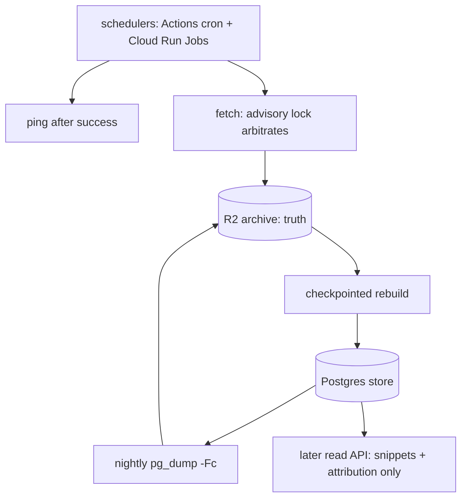

# Durability and public serving

Follow-ups from the 2026-08-25 adversarial review of the ingestion layer
(`docs/2026-08-18-ingestion-layer-spec.md`), plus one product ruling made today.
One item is ruled: the public read API serves **snippets + attribution**, never
bulk full text. The rest — dead-man's switch, redundant schedulers, checkpointed
rebuild, nightly Postgres snapshots — is proposed for approval; nothing here is
built yet.

> [!TLDR] What this settles
>
> Collection loss must be detected by something that does not depend on the
> collectors (a dead-man's switch). Recovery gets three layers — archive as
> truth, checkpointed rebuild, nightly `pg_dump` to R2 — and explicitly no
> second live database. Public serving is metadata plus a deterministic snippet
> and a deep link; full-text redistribution is rejected.

## 1. Problem and constraints

Four review findings, in consequence order:

1. **Silent collection loss.** History cannot be backfilled (spec §1), so a
   missed sample is permanent loss. Today the only signal that collection
   stopped is a human noticing stale reports; a disabled workflow, an expired
   secret, or a paused Neon project all fail silently.
2. **Rebuild is O(all history).** Replay cost grows daily; past roughly five
   months of corpus it exceeds the 60-minute Actions timeout
   (`.github/workflows/fetch.yml`), and the "moving hosts is a DSN change"
   property decays into hours of laptop time.
3. **No fast restore path.** The store is derivable from the archive, but only
   by full replay (finding 2) — there is no minutes-scale recovery artifact.
4. **Serving posture undecided.** Spec §5.6 implies the future API serves stored
   `documents.markdown` to all comers; posting text is copyrighted by employers,
   and redistributing it publicly differs legally from personal caching. Ruled
   2026-08-25: snippets + attribution (section 3.5).

Constraints: free-tier economics hold (R2 free tier absorbs snapshots for years
at projected sizes); exactly-one-writer semantics are kept everywhere; no new
datastore is introduced (NoSQL considered, rejected — section 5);
provider-neutral where infrastructure choices are cheap to change later.

**Non-goals:** the L2 extractor itself; auth and rate limiting for the public
API; board discovery; multi-region anything; monitoring beyond collection
liveness and storage size.

## 2. Proposed design

Three durability layers behind the existing truth model, one detection layer in
front of the collectors, and a serving contract for the later API:



The archive stays the only truth. Snapshots are derived artifacts stored in the
same bucket; the rebuild regenerates the store from manifests; the dead-man's
switch watches whether _any_ scheduler succeeded recently.

## 3. Components

### 3.1 Dead-man's switch

After a successful `fetch`, POST to a health-check service (healthchecks.io free
tier or equivalent self-hosted ping URL); alert when no ping arrives within ~36
h. One env var (`JOB_HUNTER_PING_URL`), one line in `fetch.run`, no dependency
in tests (unset = skipped). Detects every no-run cause: workflow disabled,
secrets expired, Neon paused, runner outage — including correlated failures
across redundant schedulers, which redundancy alone cannot catch.

### 3.2 Redundant schedulers

GitHub Actions cron stays primary; a Cloud Scheduler → Cloud Run Jobs trigger
runs the same image on a different minute as secondary. No leader election:
whichever fires first takes the advisory lock and writes; the loser exits 0
("already running"), which is already implemented behavior. Two independent
clouds failing on the same day is categorically rarer than one cron misbehaving.
Cost ≈ zero (scale-to-zero).

### 3.3 Checkpointed rebuild

`rebuild` records its progress watermark (`last_ingested_attempt`) inside the
work schema's `schema_meta`, committing every N attempts. An interrupted rebuild
resumes from the watermark; safety is free because `ingest_attempt` is
idempotent per attempt. This converts the rebuild cliff (finding 2) into a
resumable batch job and composes with sharding-by-board later. Trigger to
implement: projected replay time approaching ~30 minutes.

### 3.4 Nightly snapshot

After fetch succeeds (same workflow, sequenced after the fetch step, so the
single-writer guarantee makes the dump consistent without transaction
gymnastics):

```bash
pg_dump --format=custom "$JOB_HUNTER_DATABASE_URL"
# upload to R2 key:  snapshots/YYYY/MM/DD/store.dump
```

Retention grandfather-father-son: 7 daily, 4 weekly, 6 monthly. Sizes are
tens-to-hundreds of MB compressed; years of retention cost cents. Restore is
`pg_restore` into any Postgres 17 — minutes, provider-independent.

### 3.5 Serving contract (ruled)

Public read API responses carry posting metadata (title, company, locations,
compensation, lifecycle dates — facts), a **deterministic snippet** of the
description (fixed rule, e.g. first paragraph or first N characters of canonical
Markdown, stable across rebuilds), and a deep link to the origin ATS posting for
attribution. Full description text is never served; bulk export is never
offered. Extraction-derived artifacts (L2 demand profiles) are derived insights
about postings, not copies, and may be served. A takedown contact ships with the
API at launch.

Consequence to resolve before the API layer is designed: BYOA matching runs in
the user's agent and needs document text, which snippets deny it. Two compatible
resolutions — decide when the API is scoped: (a) fetch-through: the client
requests a document by hash at match time and the service proxies it from the
origin ATS rather than serving its stored copy; (b) profile-based matching:
clients match against server-computed demand profiles instead of raw text, which
the parsing direction already leans toward.

## 4. Data flow

Nightly: scheduler fires (either cloud) → lock acquired → boards fetched,
manifests/blobs archived → store ingested → success ping sent → snapshot dumped
and uploaded. Weekly/monthly: snapshot rotation prunes old keys; restore drill
restores the latest dump into scratch Postgres and asserts `schema_version` plus
row counts against live.

## 5. Decisions and trade-offs

- **Snippets + attribution** for public serving. Rejected: full-text API
  (redistributes copyrighted JD text to all comers); gated full text (more legal
  surface and auth machinery than a launch needs — revisit if users demand it);
  fetch-through-only (best legal posture, but operationally heavier and useless
  offline — kept as the matching-time mechanism, not the browsing surface).
- **Dead-man's switch** over more replicas-without-monitoring: redundancy
  without liveness detection still fails open. Both together are the design.
- **Two redundant schedulers** over SQS-style crawl queues: the queue pattern
  solves worker-level transient failures, which `http.py` retries plus the drop
  guard already handle; nothing detects a silent trigger. Adds no new vendor (an
  AWS queue would).
- **Checkpointed rebuild** over sharding-first: same watermark machinery the
  incremental ingest already uses; sharding can layer on when measured.
- **`pg_dump` snapshots** over a second live database: the store is derived
  state; a twin doubles burn, introduces divergence arbitration, and buys little
  over minutes-scale restore from a dump. Over Neon-native backups: portability
  to any host, independence from one provider's tier terms.
- **No NoSQL snapshot store.** The snapshot's only consumer is "become the
  Postgres store again"; a different engine means converters on both paths and a
  third representation of truth. Object storage plus keys — the archive — is
  already the system's document-store layer.

## 6. Failure modes

| Failure                         | Detected by            | Recovered by                    |
| ------------------------------- | ---------------------- | ------------------------------- |
| Workflow disabled / secret gone | dead-man's switch      | re-enable; interval widened     |
| One scheduler down              | the other still writes | none needed                     |
| Both schedulers down            | dead-man's switch      | manual run backfills nothing*   |
| DB lost / corrupt               | status, drill          | restore dump, then `ingest` gap |
| Rebuild interrupted             | watermark absent       | rerun; resumes from checkpoint  |
| Snapshot job fails              | workflow step red      | archive still truth; next night |

\* Missed days remain missed — history cannot be backfilled. Detection bounds
the window; it cannot undo it.

## 7. Testing

- Ping: unit test that a successful run pings and a failed run does not (URL
  unset → no-op).
- Resume: integration test kills a rebuild midway, reruns, asserts identical
  final tables to an uninterrupted rebuild.
- Snapshot drill: monthly automated restore into a scratch schema with count
  assertions; wired as a scheduled workflow, not documentation alone.
- Scheduler redundancy: manual dispatch of both triggers in one hour; assert one
  run wrote and one exited "already running".

## 8. Open questions

> [!QUESTION] Unresolved
>
> Snippet definition: exact deterministic rule (first paragraph vs N characters)
> and whether it comes from canonical Markdown at query time or is materialized
> per version. Matching resolution for BYOA: fetch-through, profile-based, or
> both — decided when the API layer is scoped. Health-check vendor: hosted
> (healthchecks.io) vs self-hosted ping endpoint. Whether the sustainability
> statement (bus factor, best-effort position) belongs here or in the README
> rewrite already noted as owed in spec §11.
